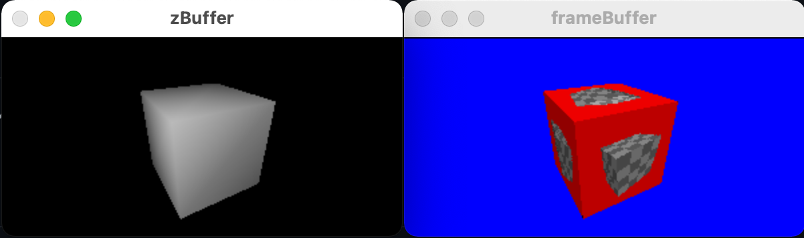
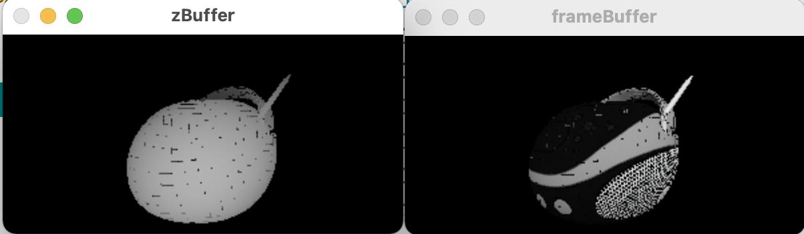
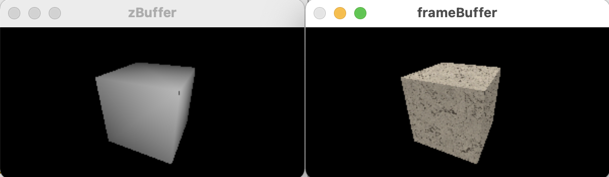
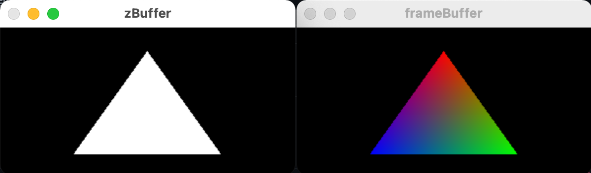
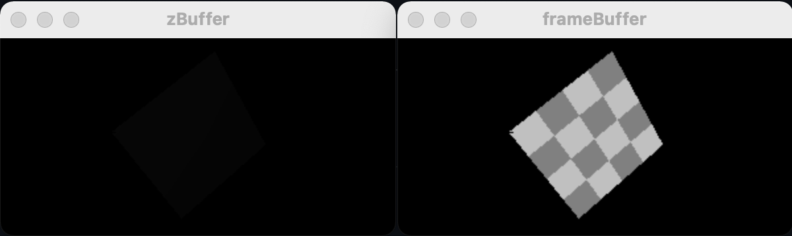

# CppGL(个人练习用)

cpp 实现部分 opengl api 以及 shader 模拟(依赖 C++反射提供额外信息)

## 截图

## 实现情况

- Attribute 数据格式支持 GL_FLOAT/GL_UNSIGNED_BYTE
- Uniform 数据格式支持 vec2/vec3/vec4/mat3/mat4/int
- Texture TEXTURE_WRAP_S/T: GL_CLAMP_TO_EDGE/GL_REPEAT format: GL_RGBA/GL_LUMINANCE 格式: GL_UNSIGNED_BYTE, 只支持 GL_TEXTURE_2D
- Varying 以 float 为基础单位插值, 所以支持任意以 float 为基础单位的 struct
- FrameBuffer 格式: GL_RGBA+GL_FLOAT/GL_UNSIGNED_BYTE
- RenderBuffer 格式: GL_DEPTH_COMPONENT32F

## TODO

- PBR

## 流程

glDrawElements 目前的实现支持 attribute 访问增加索引, 显式重复的"vertex", 目前依然过 shader 了, 而无论 glDrawArrays/glDrawElements opengl 内部 vertexshader 执行会有缓存[Rendering_Pipeline_Overview](https://www.khronos.org/opengl/wiki/Rendering_Pipeline_Overview)

> One limitation on vertex processing is that each input vertex must map to a specific output vertex. And because vertex shader invocations cannot share state between them, the input attributes to output vertex data mapping is 1:1. That is, if you feed the exact same attributes to the same vertex shader in the same primitive, you will get the same output vertex data. This gives implementations the right to optimize vertex processing; if they can detect that they're about to process a previously processed vertex, they can use the previously processed data stored in a post-transform cache. Thus they do not have to run the vertex processing on that data again.

#### glDrawElements

0. 初始化(指针:fbo/vao/indicesPtr 分配 varying/clipSpaceVertices/FrameBuffer/RenderBuffer 内存)
1. 循环 0 ~ count
   1.0. 根据 indicesPtr 读取映射后的 indices
   1.1. 设置 attribute
   1.2. 执行 vertex shader
   1.3. 收集 varying 和 gl_Position
2. 判断 mode == GL_TRIANGLES
   2.0. 读取 a b c 的 varying 和 gl_Position
   2.1. 算出 screenspace triangle 的 boundingbox 遍历矩形(光栅化)
   2.2.0. 重心插值 + 透视除法
   2.2.1. 判断是否三角形内
   2.2.2. 判断深度
   2.2.3. 近远平面裁剪
   2.2.4. 重心插值 varying 并设置
   2.2.5. 执行 fragment shader
   2.2.6. 判断 discard 根据格式写入 framebuffer/renderbuffer
